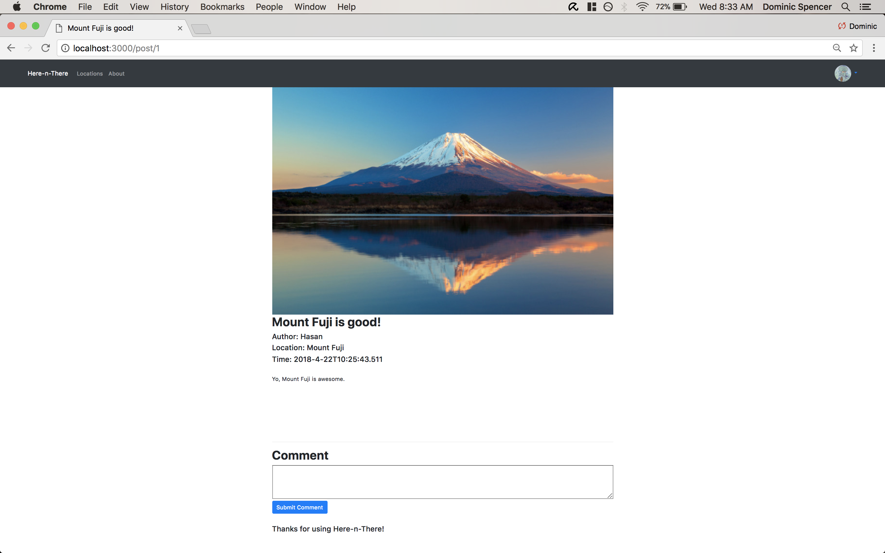
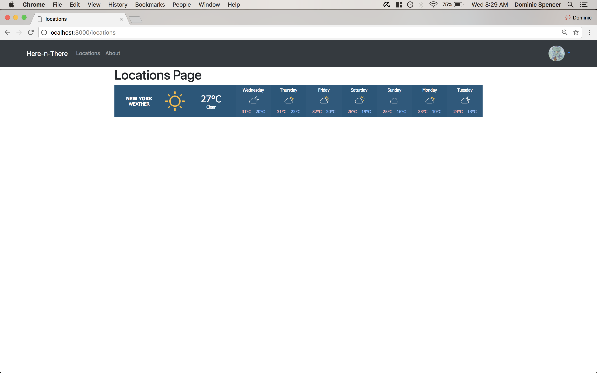
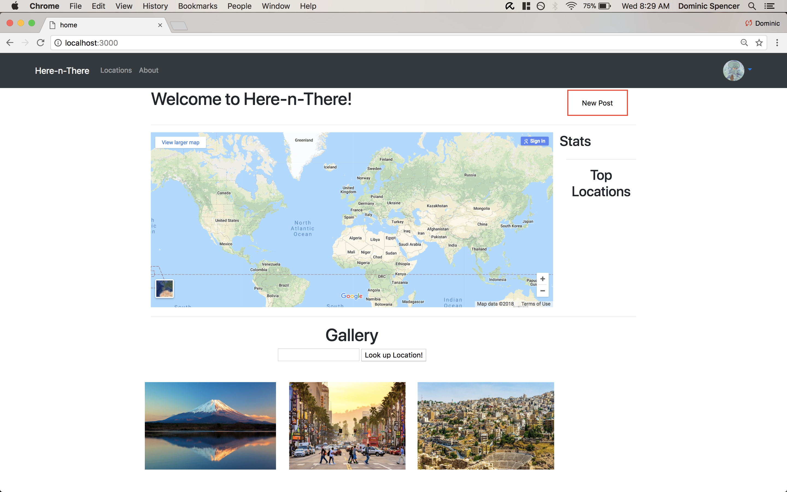

__Milestone 4__ 

__* Screenshots__:

__* Changes to Skeleton:__ 
There have been vast improvements in how the homepage appears. The layout of the homepage basically looks like it should, minus the color and font changes which should be minimal. Everything does have its place. There are also great additions to the new post page, where you can now change the styling of your blog post to fit your desires. The only pages that were not changed are the profile and location page, which will undergo renovation in the following milestone. 

__* Privacy plans:__

We plan to use a login with Google accounts. We will have sessions for each user, and they will only have access to public posts and their own information (not others). The sessions will allow us to know who is online and to put their information using the GoogleYoYo to the profile page. User data will be retrieved through a key associated with that user in the database. 

