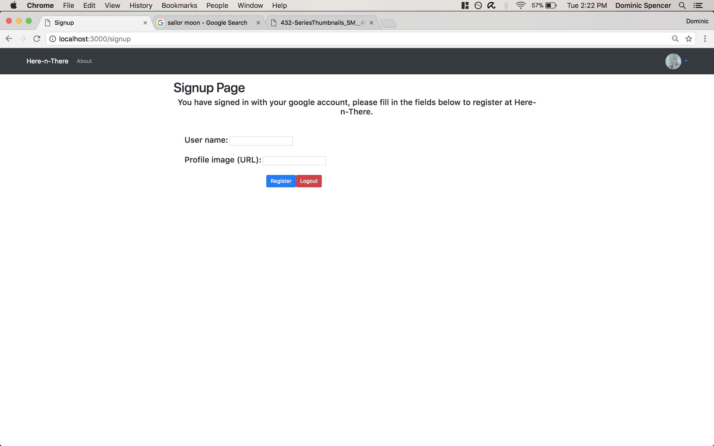
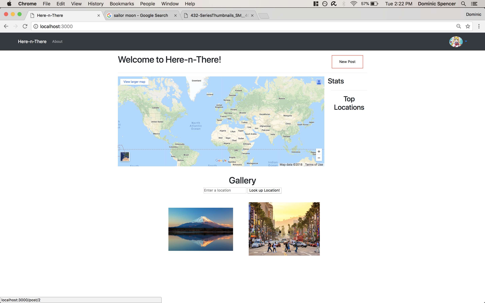
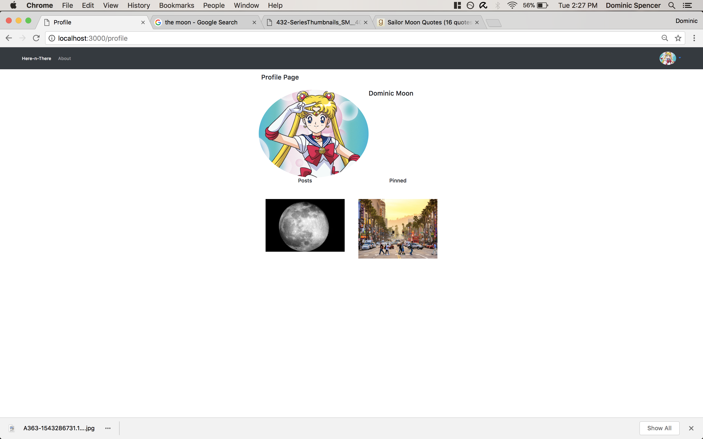
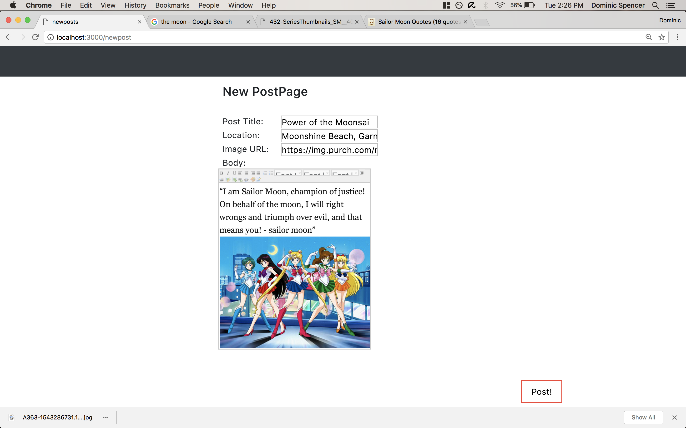
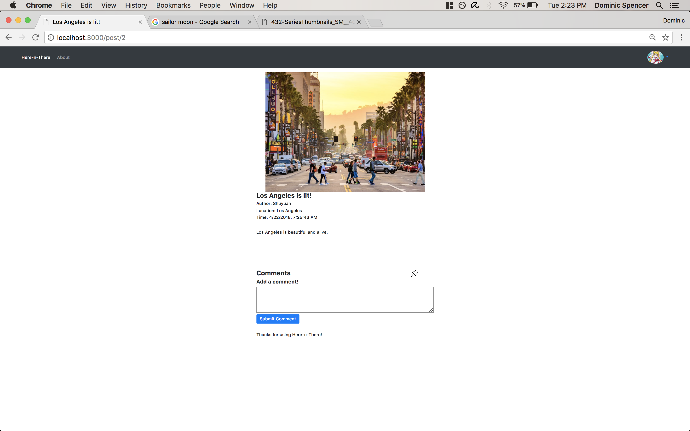
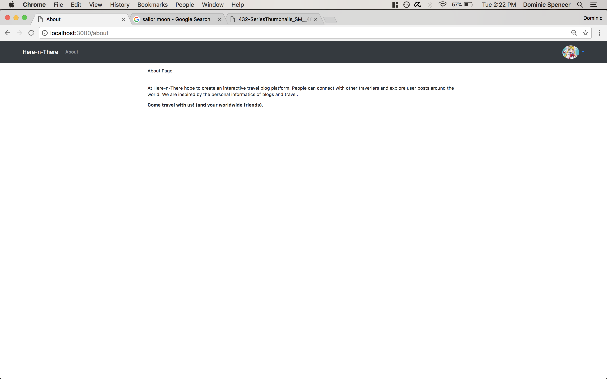
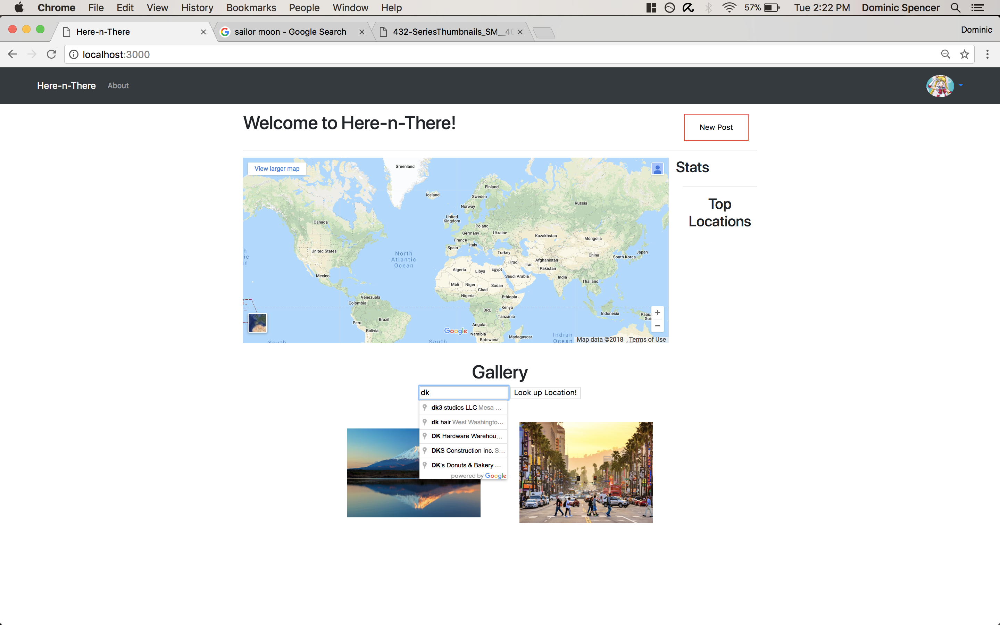

**Milestone 5** 

* **Screenshots:** 

* **Explanation of changes to UI:** 
1. Editted the navigation bar to a minimalist selection of options. 
2. Included the Google Places API to allow auto-complete on inserting and looking up locations. 
3. Placed pinned posts and personal posts on the profile page. 
4. Enabled commenting, pinning/unpinning posts and deleting posts if the author chooses to do so. 
5. Enabled Google login which causes a prompt to sign up if account did not exist. 

* **Two non-trivial actions:**

1. Adding content to the blog: 
a. Create a new post: A user can add a title, location, image and content to a post and add that post to the website for all other 
                      users to see. 
b. Add a comment to an existing post: A user can comment on a pre-existing post with what they thought about the post.

2. Pinning/unpinning posts: A user can pin a post so that they have access to the post even if it gets lost on the homepage. 
                            The pinned post will be found on their profile. A user can also unpin the post if they don't want 
                            to have it on their profile anymore.
                          
3. Searching for posts of a specific location: A user can enter a specific location and filter posts to that specific location by 
                                               entering the name of the name of the location and choosing the matching auto-completed option.

3. Delete post: A user can choose to delete a post that they personally wrote by clicking the "X" mark on the page of the post they 
                want to delete.
