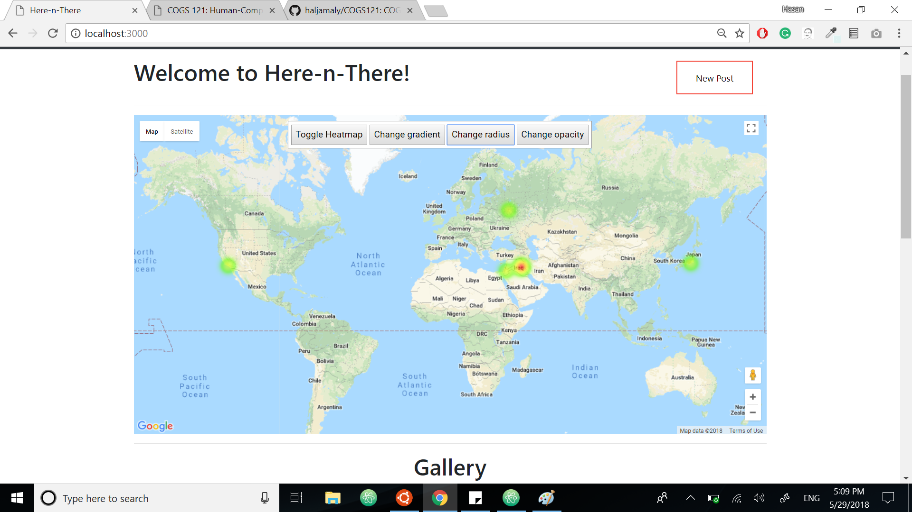

**Milestone 6** 

* **Screenshots:** 

* **Explanation of changes to UI:** 
1. Removed map iframe and added a Google Maps Javascript API map object that contains a heatmap visualization in the profile page. 
2. Added a new Google Maps Javascript API map to the profile page and placed pins for where personal posts have been tagged. 
3. Linked the location lookup bar to the map to enable zoom in of specific locations that are being searched. 

* **Data Visualization Screenshots:** 

* **Data Visualization Explanations:** 
1. The first picture represents the heatmap, which is a representation of the density of the posts that users have made using the travel 
   blog. The more intense the red color, the more posts that have been made in that specific region. 
2. The second picture represents a different visualization that uses numbers instead of a colored heatmap. This represents the number of 
   posts that are made in specific locations (meaning a circle with the number 5 on the map indicates that 5 posts have been tagged to a
   location in this region). The user can click on the number to zoom into the region and break down the specific locations that have 
   been tagged by the posts. 
